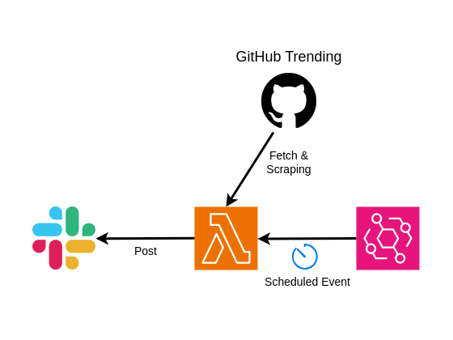

# GitHub Trending Slack Bot with AWS Lambda

Post Daily GitHub Trend Repositories to the specific Slack channel.

## NOTE
This project is temporally focused on TypeScript Trending.  
Other languages will be focused on in the near future...

## Requirements
* Bun: `^1.0`

## Architecture


## Installation
```shell
$ bun install
```

## Deployment
```shell
$ cdk deploy
```

After deployment, you should configure environment variables below.
* SLACK_BOT_ACCESS_CHANNEL: target Slack channel to post
* SLACK_BOT_ACCESS_TOKEN: Slack Access Token

## Testing
```
$ bun test
```
